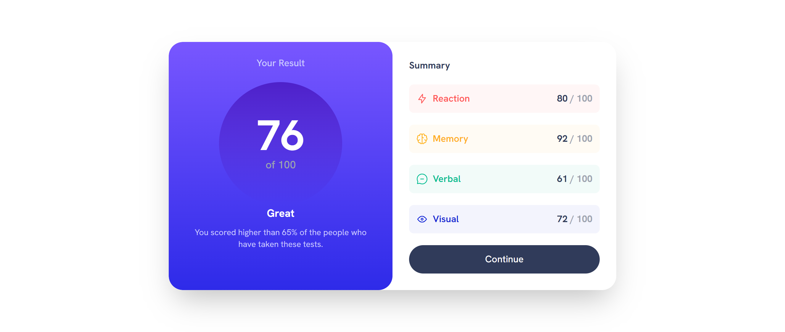

# Frontend Mentor - Results summary component solution

This is my solution to the [Results summary component challenge on Frontend Mentor](https://www.frontendmentor.io/challenges/results-summary-component-CE_K6s0maV).

**NOTE: I did not have access to the Figma sketch file, so the design is far from being pixel perfect.**

## Table of contents

- [The challenge](#the-challenge)
- [Screenshot](#screenshot)
- [Links](#links)
- [Built with](#built-with)
- [Author](#author)

## The challenge

Users should be able to:

- View the optimal layout for the interface depending on their device's screen size
- See hover and focus states for all interactive elements on the page

## Screenshot

## Links

- Live Site URL: [Solution Hosted using Netlify](https://endearing-faun-e1792e.netlify.app/)

## Built with

- Semantic HTML5 markup
- Tailwindcss
- Mobile-first workflow

## Author

- Frontend Mentor - [@Marvin-Figueroa](https://www.frontendmentor.io/profile/Marvin-Figueroa)

